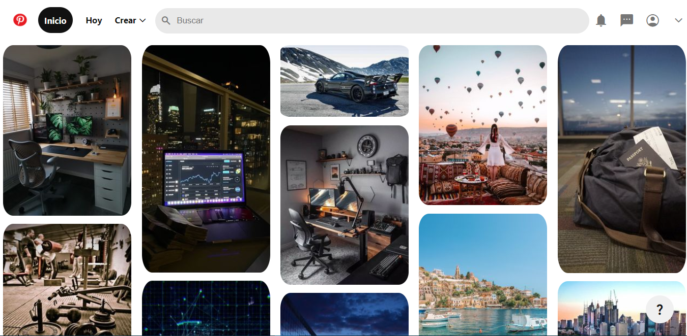
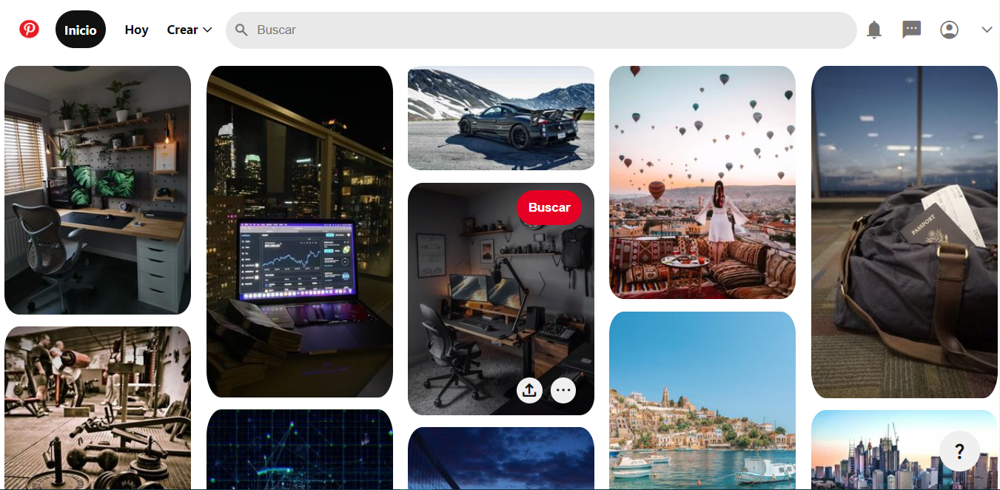

# Pinterest Clone 

> El siguiente proyecto buscaba replicar la página de inicio de Pinterest utilizando HTML y CSS

Accede haciendo click en el siguiente icono:

## Resultado

## Tecnologías utilizadas

